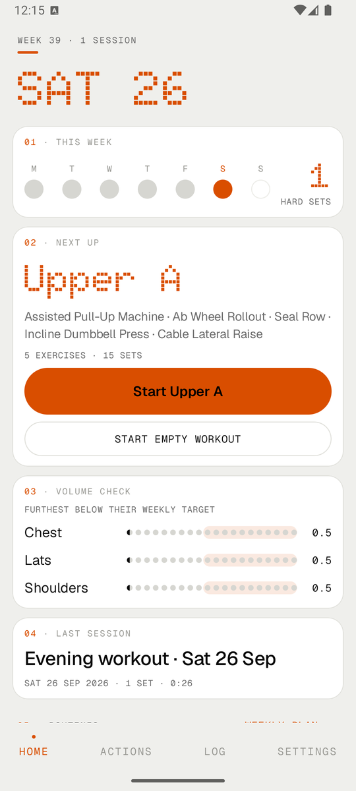
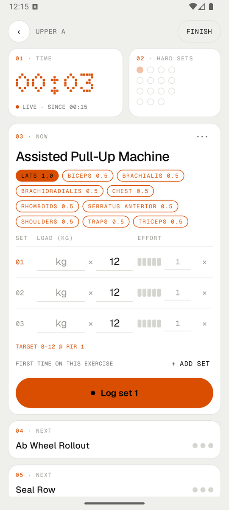
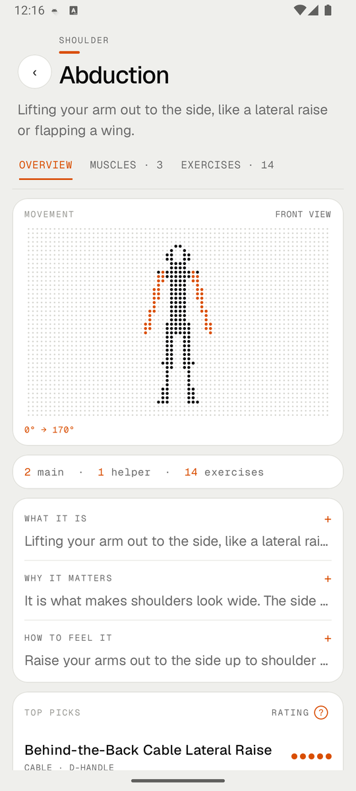
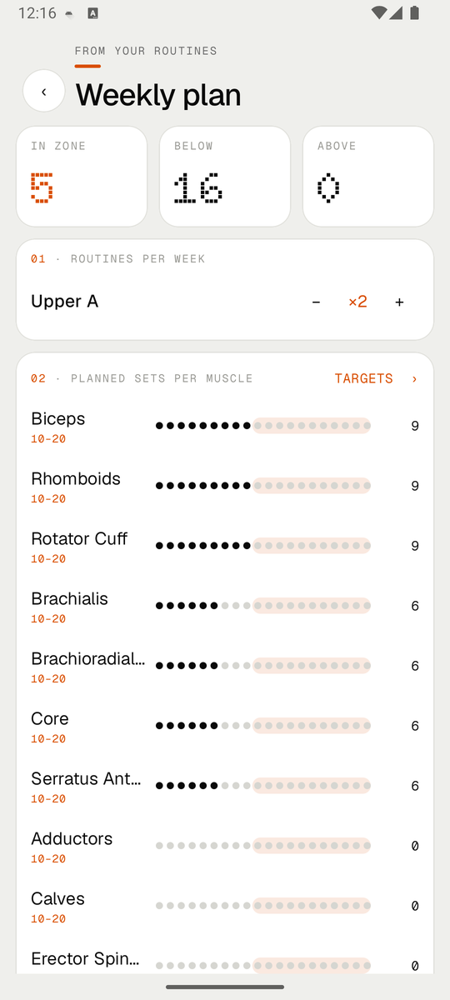
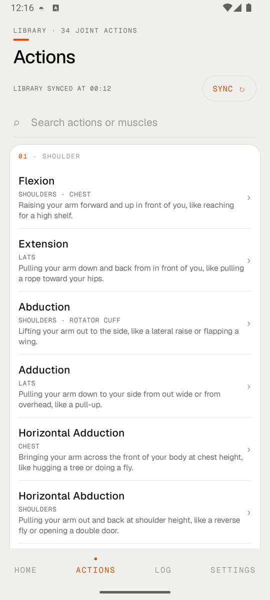
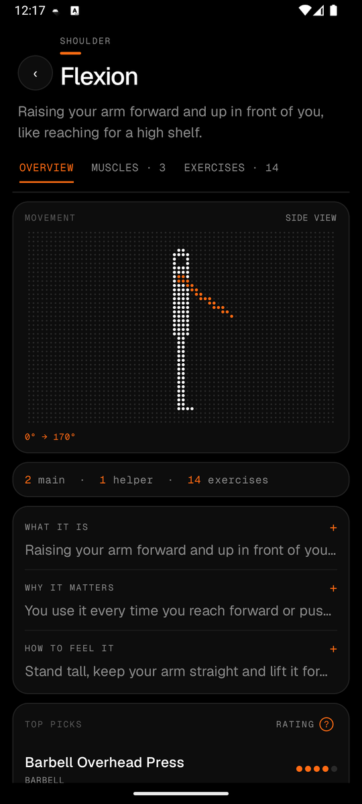

<div align="center">

# sbl.db

**A workout log for people who read the studies.**
Free, offline, no account. Android.

[Download the latest APK](https://github.com/sonatadev/sbldb/releases/latest) · [All releases](https://github.com/sonatadev/sbldb/releases)

<br>

&nbsp;
&nbsp;
&nbsp;


</div>

<br>

## Why this exists

Hevy and Strong are good apps. They also lock the useful parts behind a subscription,
and they think in *exercises*, while most of the evidence-based training advice you see
lately talks about *muscles*: how many hard sets a muscle got this week, how close to failure
you went, whether the exercise loads it in the stretched position.

sbl.db is built around that second way of thinking. It's free, and it stays free.
There's nothing to unlock.

## How it thinks

The library isn't a flat list of 150 exercises. It's organised by **joint action**
(shoulder flexion, elbow extension, hip extension and so on), 34 of them. Each one knows:

- which muscles do the work, split into prime movers and helpers, down to regions like the
  three heads of the triceps
- which exercises train it, rated 1 to 5 for how well they load it through a full range
- what it is, why it matters and how to feel it, in plain words or in anatomy terms if you
  switch the app to *Expert*

Everything else comes from there. When you log a set, it counts **1 set** for the muscles
that are prime movers and **0.5** for the helpers, and only if it was a hard set (RIR 4 or less,
warm-ups excluded). That's how the weekly volume numbers are worked out.

## What's in it

<table>
<tr>
<td width="50%" valign="top">

**In the gym**
- Routines with sets, rep range, target RIR and rest per exercise
- Rest timer with a notification that keeps counting when the phone is locked
- A **NEXT** line per exercise: double progression from your last session, tap to fill in the sets
- PR chips when a set beats your best e1RM, heaviest weight or reps at a load
- Set types: warm-up, drop set, myo-reps, lengthened partials, to failure
- Swap an exercise for the closest match on the same joint actions (your sets stay)
- A note per exercise that sticks around ("seat 4, pin 7")

</td>
<td width="50%" valign="top">

**After the gym**
- Weekly volume per muscle as a row of dots against your target zone
- A weekly plan that adds up all your routines by how often you run them
- Per-muscle targets if 10–20 sets isn't right for you
- Calendar, monthly stats, e1RM chart per exercise
- Body weight with a 7-day average and your weekly rate of change
- Edit any past workout, down to the start time
- Your own exercises, rated on joint actions like the built-in ones

</td>
</tr>
</table>

Plus light and dark mode, seven accent colours, kg or lb, English or Italian.

<div align="center">
&nbsp;

</div>

## Your data

Everything lives on your phone. There's no server and no login.

You can export a full JSON backup or a CSV of every set (it opens fine in Excel or Sheets),
and restore from a backup later. If you pick a folder in Settings (a Google Drive folder works)
the app writes a backup there after every workout and keeps one per week for the last month.

## The exercise library lives in this repo

The content isn't hardcoded. It's four YAML files in
[`app/src/main/assets`](app/src/main/assets):

```
muscles.yaml         21 muscle groups and their regions
joint_actions.yaml   34 joint actions, muscles, explanations, animation
exercises.yaml       158 exercises with ratings and aliases
glossary.yaml        the terms the app explains
```

The app ships with a copy and checks this repo for a newer one at startup (or when you hit
*Sync* in the library). New content is validated before it's used, so a typo here can't break
anyone's app. It just gets ignored until it's fixed.

That means adding an exercise is a pull request, not an app update. A few house rules:

- favour exercises with good evidence behind them over old habits
- if chest support is a common option, add both versions (Seal Row *and* Barbell Row)
- add the names people actually search for, including gym slang (`"pulley"`, `"lat machine"`, `"panca piana"`)
- only add something if you're sure what it trains

The unit tests (`./gradlew testDebugUnitTest`) run the same checks the app does.

## Building it

You need Android Studio (or just the JDK it bundles) and the Android SDK.

```sh
./gradlew assembleDebug            # debug build
./gradlew testDebugUnitTest        # unit tests, including content checks
./gradlew connectedDebugAndroidTest  # database and backup tests on a device or emulator
```

Kotlin, Jetpack Compose and Room. No network libraries, no analytics, no ads SDK.
Min SDK 24 (Android 7).

## Where it's going

Rough list, no dates:

- translating the library content, not just the interface
- more exercises and better animations, mostly through the YAML
- a Play Store release once it's been used for a while by more than one person

---

<sub>Made in Italy. Counting sets shouldn't need a subscription.</sub>
